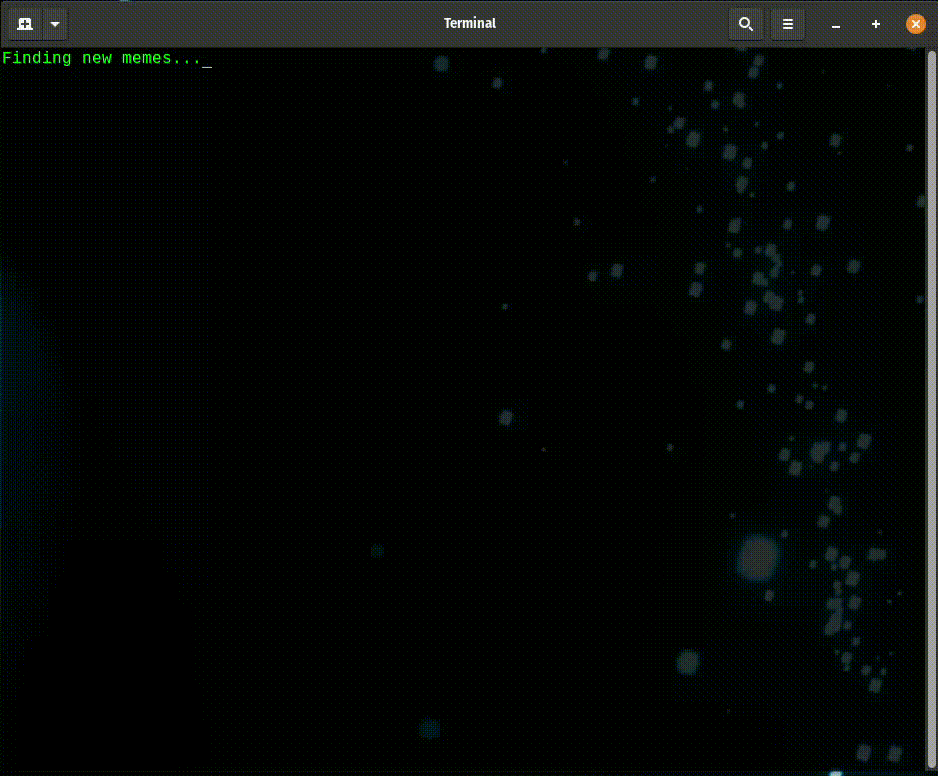

# System Loading Emulator

System Loading Emulator is a toy application that simulates a command line program loading multiple different 
resources.

You may configure the content and a range for the randomized loading duration for each message by editing the 
messages.json file.

The message sets are grouped under a label to make them selectable.  Pass the -s flag with the label of the message
set that you would like to use.

